# Компилятор константной строки Zig

## Работу выполнил: Дементьев Артём Андреевич, группа АВТ-313


# Лабораторная работа 1. Разработка пользовательского интерфейса (GUI) для языкового процессора


## Цель работы

### Создание кроссплатформенного графического интерфейса (GUI) для языкового процессора в виде специализированного текстового редактора.


## Используемые технологии

### .NET 10, C#, Avalonia UI, VS Codium


## Инструкция по сборке и запуску

### Зависимости: .NET 10
### Сборка проекта:
```
dotnet publish -c Release -r [OS] --self-contained true
# OS: win-x64, linux-x64
```
Исполняемый файл генерируется в Gui/bin/Release/[OS]/publish/


## Описание интерфейса и функций

### Вид интерфейса
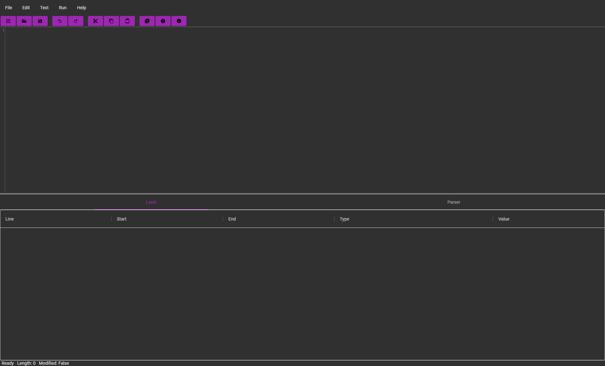

### Открытие файла
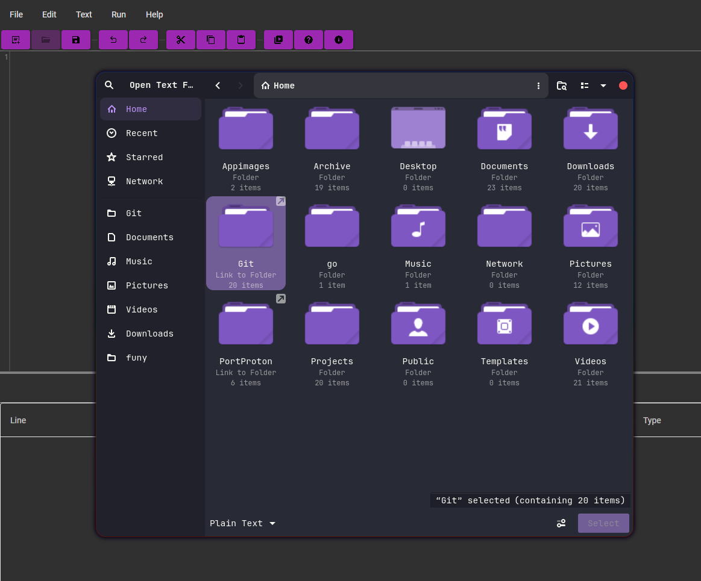

### О программе
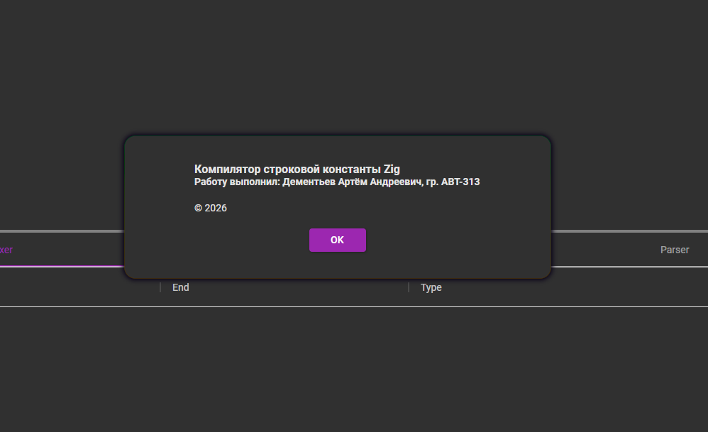

### Меню
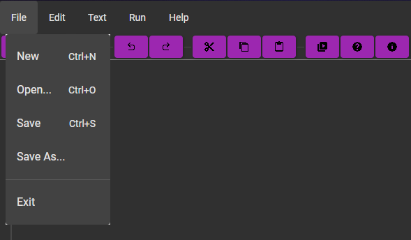
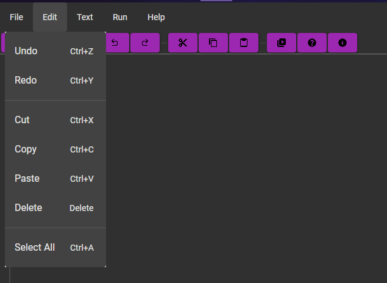
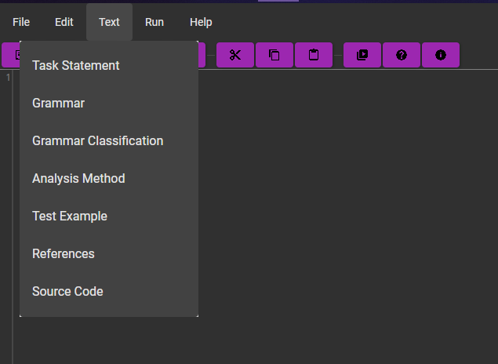
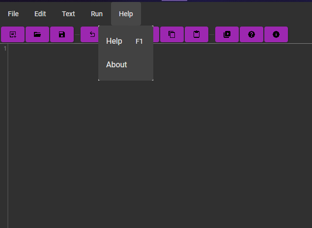


# Лабораторная работа 2. Разработка лексического анализатора (сканера)


## Цель работы

### Разработать лексический анализатор (сканер) в соответствии с индивидуальным вариантом задания, интегрировать его в приложение из лабораторной работы №1 и обеспечить наглядный вывод результатов.


## Вариант задания

### Вариант 65 - Объявление строковой константы на языке Zig
```
const GREETING: []const u8 = "Hello World";
const GREETING: []const u8;
```
### Допустимые лексемы
1. Ключевое слово const
2. Ключевое слово u8
3. Пробел
4. Идентификатор
5. Оператор-двоеточие
6. Операторы-квадратные скобки
7. Оператор присваивания
8. Кавычки
9. Точка с запятой


## Диаграмма состояний
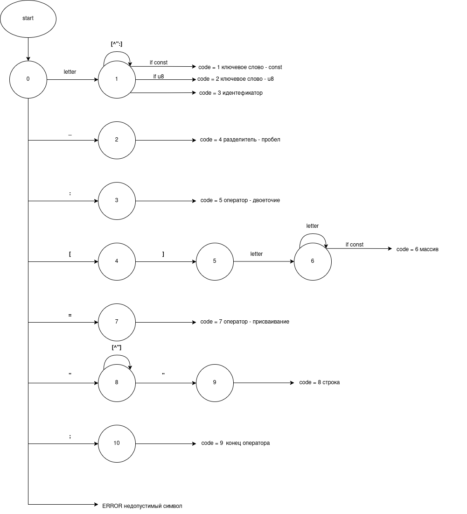


## Примеры
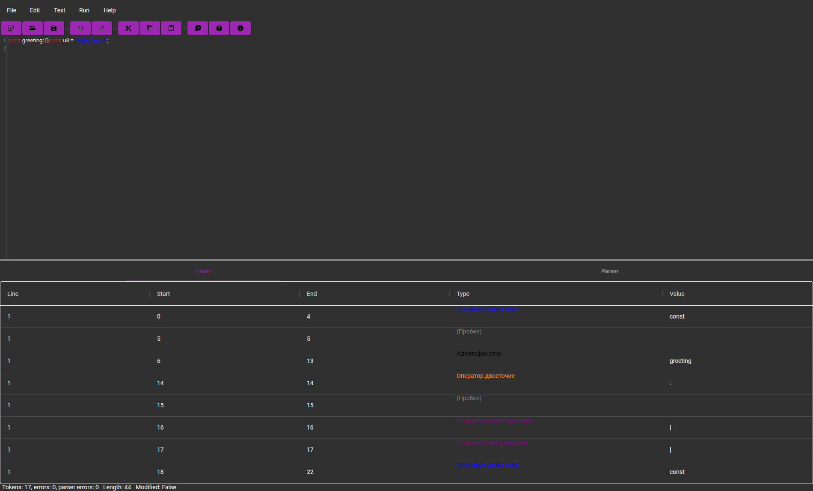
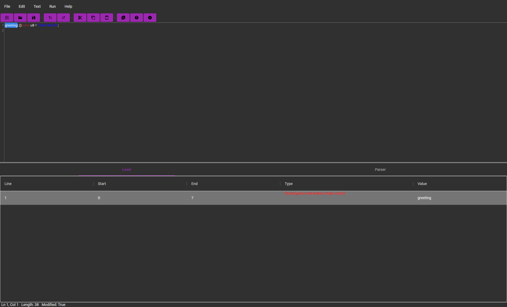
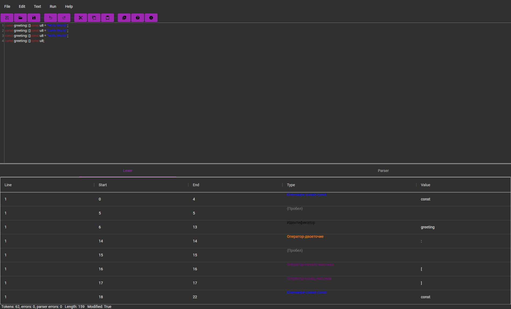


# Лабораторная работа 3. Разработка синтаксического анализатора (парсера)


## Цель работы

### Изучить назначение и принципы работы синтаксического анализатора в структуре компилятора. Спроектировать грамматику, построить соответствующую схему метода анализа грамматики и выполнить программную реализацию парсера с нейтрализацией синтаксических ошибок методом Айронса. Интегрировать разработанный модуль в ранее созданный графический интерфейс языкового процессора.


## Вариант задания

### Вариант 65 - Объявление строковой константы на языке Zig
```
const GREETING: []const u8 = "Hello World";
const GREETING: []const u8;
```
### Допустимые лексемы
1. Ключевое слово const
2. Ключевое слово u8
3. Пробел
4. Идентификатор
5. Оператор-двоеточие
6. Операторы-квадратные скобки
7. Оператор присваивания
8. Кавычки
9. Точка с запятой


## Грамматика

```
<START> -> 'const ' <CONST>
<CONST> -> letter <ID> 
<ID> -> letter <ID> | digit <ID> | '_' <ID> | ':' <COLON>
<COLON> -> '[' <BRACES_OPEN>
<BRACES_OPEN> -> ']' <BRACES_CLOSE>
<BRACES_CLOSE> -> 'const ' <CONST_AFTER_BRACES>
<CONST_AFTER_BRACES> -> 'u8' <U8>
<U8> -> '=' <EQUALS> | ';'
<EQUALS> -> '"' <QUOTE_1>
<QUOTE_1> symbols <CONTENT> | '";' 
<CONTENT> -> '"' <QUOTE_2>
<QUOTE_2> -> ';'
```

```
Z = <START>
letter -> 'a' | 'b' | 'c' | 'd' | 'e' | 'f' | 'g' | 'h' | 'i' | 'j' | 'k' | 'l' | 'm' | 'n' | 'o' | 'p' | 'q' | 'r' | 's' | 't' | 'u' | 'v' | 'w' | 'x' | 'y' | 'z' | 'A' | 'B' | 'C' | 'D' | 'E' | 'F' | 'G' | 'H' | 'I' | 'J' | 'K' | 'L' | 'M' | 'N' | 'O' | 'P' | 'Q' | 'R' | 'S' | 'T' | 'U' | 'V' | 'W' | 'X' | 'Y' | 'Z'
digit -> '0' | '1' | '2' | '3' | '4' | '5' | '6' | '7' | '8' | '9'
symbols ∈ V_T 
```

```
V_T = {a, b, ..., z, A, B, ..., Z, 0, 1, ..., 9, _, :, =, ", ;, [, ]}
V_N = {START, CONST, ID, COLON, BRACES_OPEN, BRACES_CLOSE, CONST_AFTER_BRACES, U8, EQUALS, QUOTE_1, CONTENT, QUOTE_2}
```

## Грамматика - автоматная
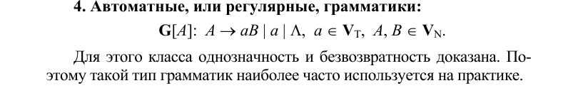


## Конечный Автомат
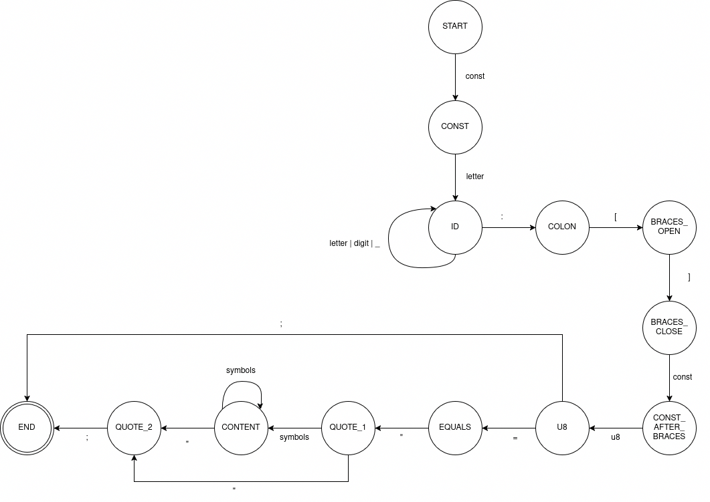


## Метод диагностики и нейтрализации синтаксических ошибок

Метод Айронса предназначен для локальной диагностики и нейтрализации синтаксических ошибок при нисходящем разборе без возвратов. Основная идея — при попадании в тупиковую ситуацию (когда построение дерева по грамматике невозможно) отбрасывать входные символы до тех пор, пока не встретится терминал, способный продолжить допустимый вывод. Алгоритм работает следующим образом:

1. По уже построенной части дерева формируется список недостающих терминалов (L), необходимых для завершения незаконченных поддеревьев.
2. Из оставшейся «хвостовой» цепочки по очереди удаляются первые символы, пока текущий терминал j не станет таким, что из стартового нетерминала грамматики выводится цепочка, начинающаяся с j. Это гарантирует, что дальнейший разбор возможен.
3. Идентифицируется тот незавершённый фрагмент дерева (куст), который изначально привёл к ошибке.
4. Для этого куста и всех вышестоящих незаконченных поддеревьев вычисляется цепочка q — последовательность терминалов, которая достраивает их до полного корректного поддерева. q получается конкатенацией недостающих терминальных цепочек.
5. Цепочка q вставляется непосредственно перед символом j, после чего разбор возобновляется с головного символа этой вставки.


## Примеры

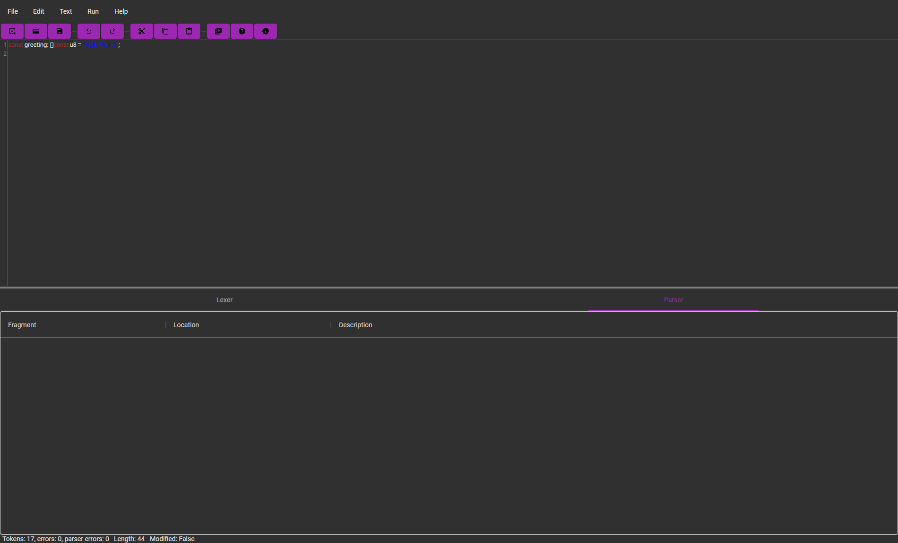
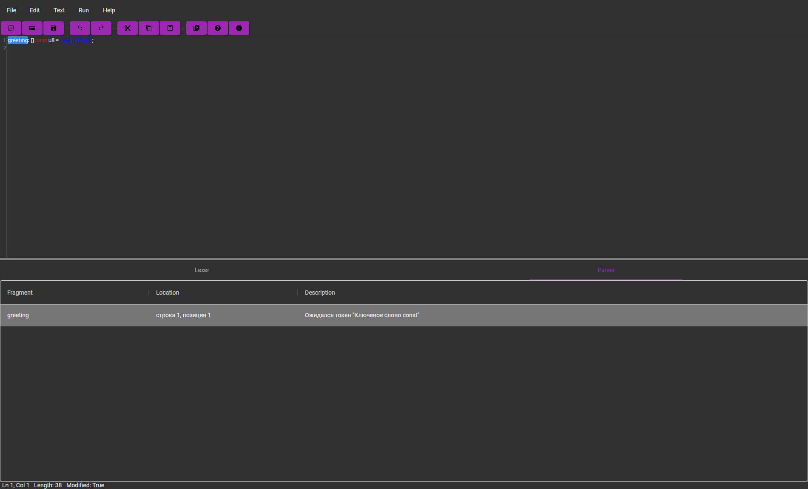
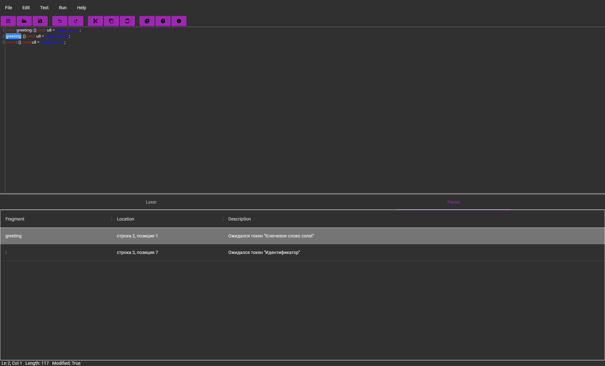


# Лабораторная работа 4. Реализация алгоритма поиска подстрок с помощью регулярных выражений


## Цель работы

### Изучить теоретические основы регулярных выражений и их применение для поиска и извлечения подстрок из текста. Освоить практические навыки использования библиотечных средств работы с регулярными выражениями, а также интеграцию алгоритмов поиска в графический интерфейс приложения.


## Варианты задания

### 1. Построить РВ, описывающее канадские почтовые индексы.
### 2. Построить РВ, описывающее шестнадцатеричный код (HEX) цвета (длиной 6).
### 3. Построить РВ, описывающее серию и номер российского паспорта.


## 1. Построить РВ, описывающее канадские почтовые индексы.

### Описание задачи: Построить регулярное выражение, валидирующее почтовые индексы Канады. Согласно стандарту, они имеют жесткую структуру вида A1A 1A1, где чередуются буквы и цифры. Между первыми тремя и последними тремя символами традиционно ставится пробел, однако в электронной форме ввода он может отсутствовать.

### Регулярное выражение: \b[A-Z]\d[A-Z]\s?\d[A-Z]\d\b

- \b — граница слова. Гарантирует, что индекс изолирован и не является частью более длинного буквенно-цифрового слова.
- [A-Z] — соответствует одной заглавной букве латинского алфавита от A до Z.
- \d — соответствует одной цифровой группе от 0 до 9.
- \s? — пробельный символ (пробел или табуляция), знак вопроса ? делает его необязательным (0 или 1 повторение).
- Вторая половина выражения \d[A-Z]\d аналогично проверяет строгое чередование: цифра, буква, цифра.

### Примеры строк, которые должны находиться:
K1A 0B1
H3Z2Y7
M4B 1V6

### Примеры строк, которые не должны находиться:

1KA 0B1 (начинается с цифры, нарушен порядок)
K1A  0B1 (два пробела вместо одного допустимого)
ABC 123 (три буквы подряд, затем три цифры подряд)

### Скриншоты
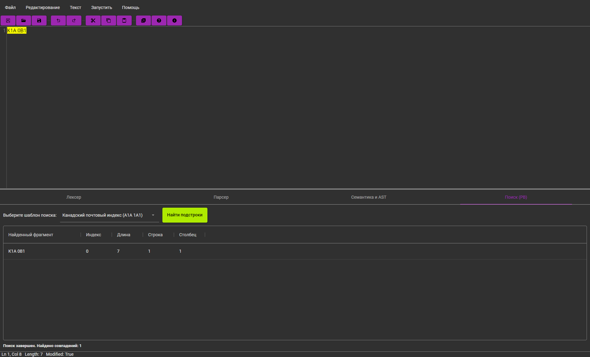
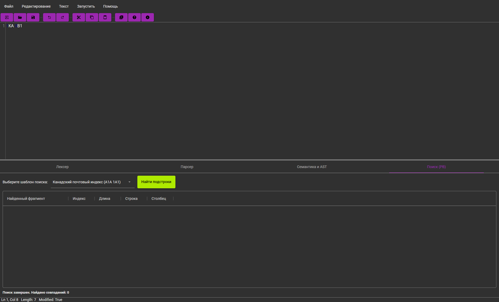


## 2. Построить РВ, описывающее шестнадцатеричный код (HEX) цвета (длиной 6).

### Описание задачи: Разработать регулярное выражение для поиска или валидации 6-символьного шестнадцатеричного формата представления цвета в веб-дизайне и компьютерной графике. Код может начинаться со специального символа-префикса #, за которым следуют ровно 6 шестнадцатеричных цифр (символы от 0 до 9 и буквы от A до F в любом регистре).

### Регулярное выражение: \b#?[0-9A-Fa-f]{6}\b

- \b — граница слова. Предотвращает ложное срабатывание, если шестнадцатеричная комбинация является частью более длинной строки (например, длинного хэша).
- #? — символ решетки. Квантификатор ? означает, что данный символ может встречаться 0 или 1 раз (код валиден как с ним, так и без него).
- [0-9A-Fa-f] — символьный класс, разрешающий любую цифру 0-9, а также латинские буквы от A до F как в верхнем (A-F), так и в нижнем (a-f) регистре.
- {6} — квантификатор точного повторения. Требует, чтобы символы из предыдущего класса повторились ровно 6 раз подряд.

### Примеры строк, которые должны находиться:
#FF5733
3a90cf
#000000

### Примеры строк, которые не должны находиться:
#FFF (не подходит, так как длина строго ограничена шестью символами)
#GGAA11 (буква G не входит в шестнадцатеричный алфавит)
#FF573399 (восьмизначный код цвета с альфа-каналом отсекается границей слова \b)

### Скриншоты

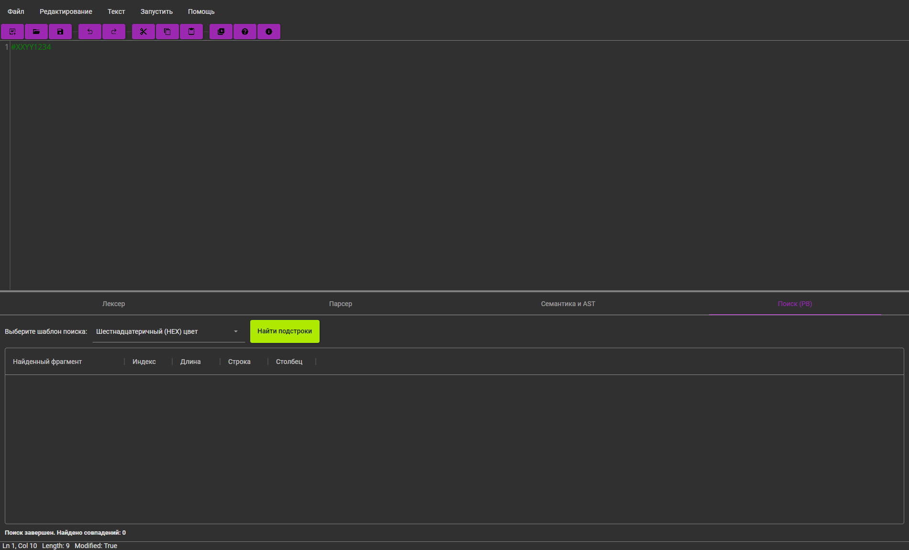


## Задача 3. Серия и номер паспорта гражданина РФ

### Описание задачи: Написать регулярное выражение, способное распознавать текстовые шаблоны серии и номера паспорта гражданина РФ. Серия состоит из 4 цифр, которые на практике могут писаться слитно (7014) или разделяться пробелом посередине (70 14). Номер состоит из 6 цифр и отделяется от серии пробелом.

### Регулярное выражение: \b\d{4}\s?\d{6}\b|\b\d{2}\s?\d{2}\s?\d{6}\b

Выражение состоит из двух альтернативных частей, разделенных оператором | (ИЛИ):

- \b — границы слова, исключающие попадание случайных длинных последовательностей цифр.
- \d{4} — первая группа, означающая ровно 4 цифры подряд (слитная серия).
- \s? — необязательный пробел между серией и номером.
- \d{6} — ровно 6 цифр подряд (номер паспорта).
- \d{2}\s?\d{2} — вторая часть альтернативы, описывающая раздельную серию: 2 цифры, возможный пробел, еще 2 цифры.

### Примеры строк, которые должны находиться:

4507 123456
45 07 123456
8016123456

### Примеры строк, которые не должны находиться:

450 123456 (в серии только 3 цифры)
4507 12345 (в номере только 5 цифр)
45A7 123456 (серия содержит недопустимый буквенный символ)

### Скриншоты
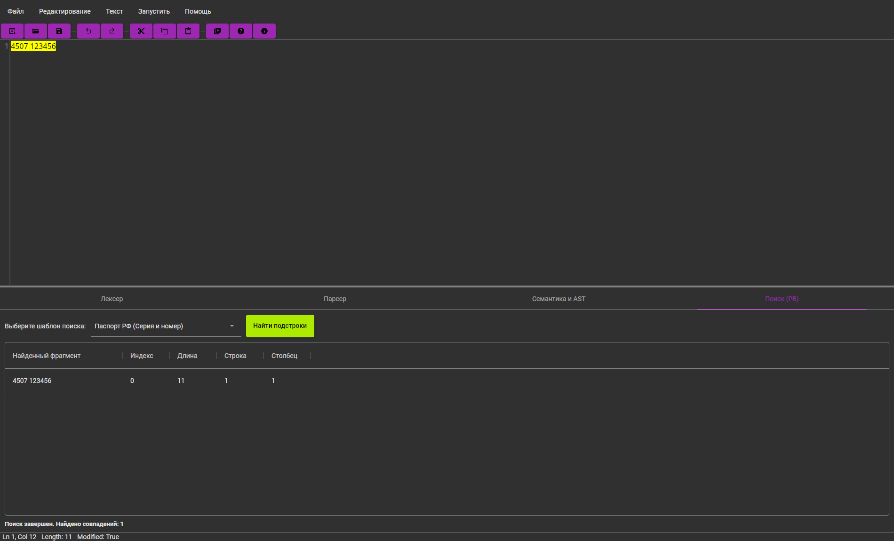


# Лабораторная работа 5. Построение AST и проверка контекстно-зависимых условий


## Цель работы

### Изучить назначение и принципы работы семантического анализатора в структуре компилятора. Освоить методы построения абстрактного синтаксического дерева (AST) и проверки контекстно-зависимых условий (семантических правил) для заданной синтаксической конструкции.


## Вариант задания

### Вариант 65 - Объявление строковой константы на языке Zig
```
const GREETING: []const u8 = "Hello World";
```

## Контекстно-зависимые условия

### Реализованные проверки

- Уникальность имён
```
const GREETING: []const u8 = "Hello World";
const GREETING: []const u8 = "Hello World"; - Выведет ошибку Семантическая ошибка: Переобъявление идентификатора 'GREETING'
```
- Использование объявленных идентификаторов
```
const GREETING1: []const u8 = "Hello World";
const GREETING2: []const u8; - Выведет ошибку Семантическая ошибка: Константа 'GREETING2' должна быть инициализирована
```


## Структура AST

### Типы узлов

- ProgramNode - корневой узел
- ConstDeclNode - узел объявления константной строки

### Рисунок AST
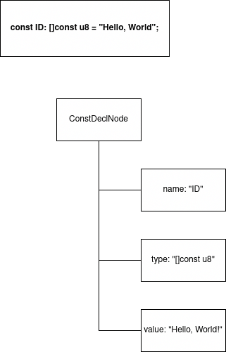

### Формат вывода в программе

```
const GREETING1: []const u8 = "Hello World";
ProgramNode
└── ConstDeclNode
    ├── name: "GREETING"
    ├── type: "[]const u8"
    └── value: "Hello, World"
```


## Тестовый пример

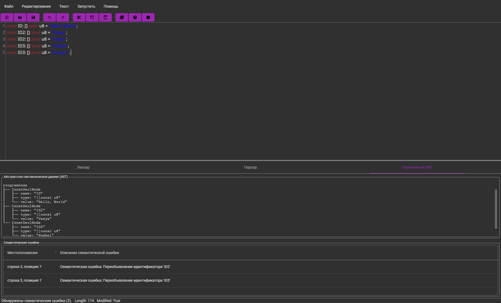


## Инструкция по сборке и запуску

### Зависимости: .NET 10
### Сборка проекта:
```
dotnet publish -c Release -r [OS] --self-contained true
# OS: win-x64, linux-x64
```
Исполняемый файл генерируется в Gui/bin/Release/[OS]/publish/
